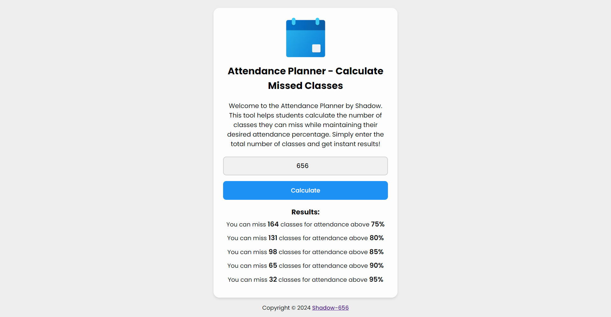

# Attendance Planner

## Overview

The **Attendance Planner** is a simple, user-friendly web application designed for students to calculate how many classes they can miss while still maintaining their desired attendance percentage. Whether you're planning a vacation or need to balance your time with other commitments, this tool helps you plan your holidays without compromising your attendance.

### URL

[Attendance Planner](https://shadow-656.github.io/Attendance-Planner/)

## Features

- Calculate how many classes you can miss to maintain attendance percentage.
- Easy-to-use interface designed for students.
- Works on both desktop and mobile devices.
- Installable as a Progressive Web App (PWA) for a native-like experience.
- Built with HTML, CSS, and JavaScript.

## How It Works

1. Enter the **total number of classes** in the input field.
2. Click the **"Calculate"** button to find out how many classes you can afford to miss while maintaining your desired attendance percentage.
3. The results will be displayed immediately.

## Usage

- **Step 1**: Visit the [Attendance Planner](https://shadow-656.github.io/Attendance-Planner/).
- **Step 2**: Enter the total number of classes in the input box.
- **Step 3**: Click on "Calculate" to find out how many classes you can miss without dropping below the required attendance percentage.

### Installation

- On Chrome (Desktop & Mobile):
  - Click on the “Install” button in the URL bar to install the Attendance Planner to your device.
  
- On Safari (iOS):
  - Tap the “Share” button and then “Add to Home Screen” to install the app on your iPhone or iPad.

## Screenshots

## Technologies Used

- **HTML**: For creating the structure of the web page.
- **CSS**: For styling the interface.
- **JavaScript**: For calculating missed classes and handling user interaction.
- **PWA**: Allows users to install the app and use it as a native-like web application.
- **GitHub Pages**: For hosting the application online.
  
## License

This project is licensed under the MIT License - see the [LICENSE](LICENSE) file for details.

## Author

- **Shadow-656** - [GitHub Profile](https://github.com/Shadow-656)
